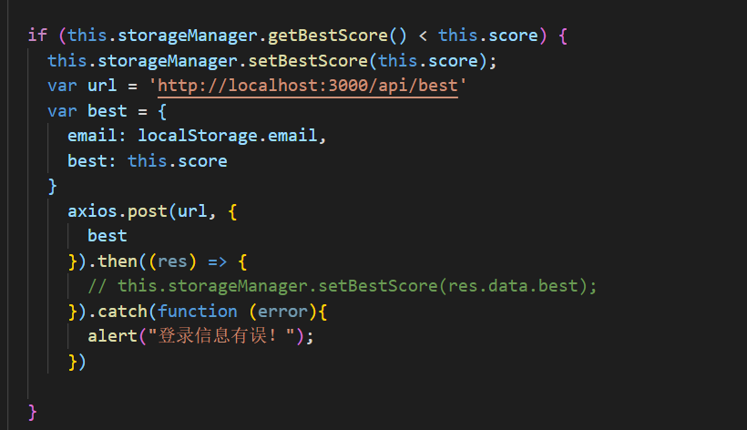
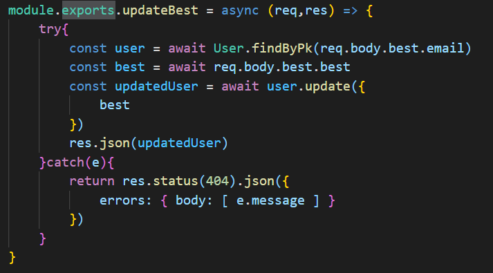
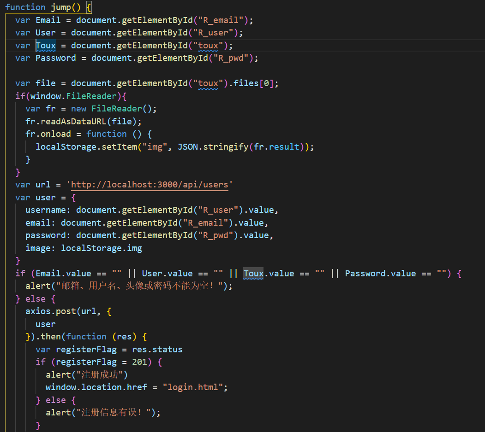
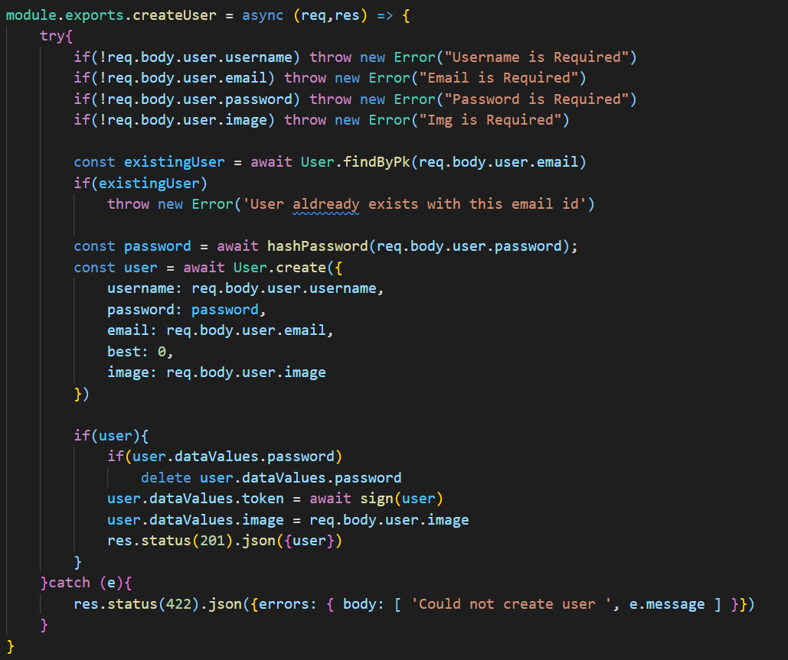
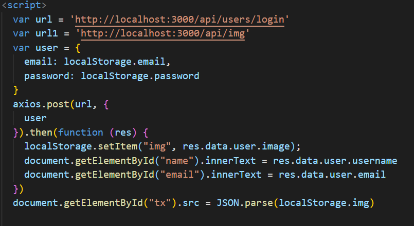
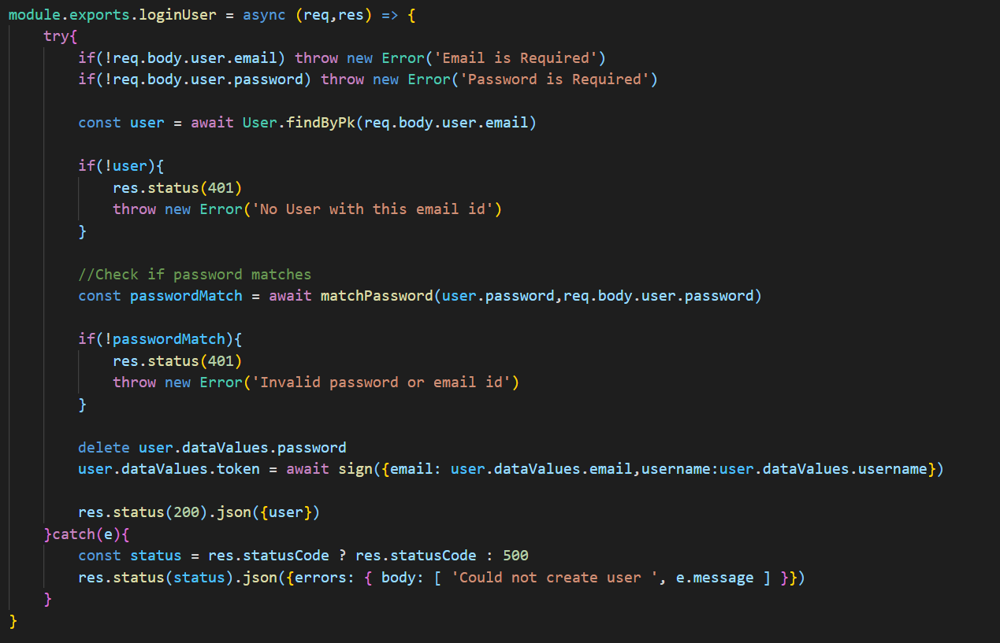
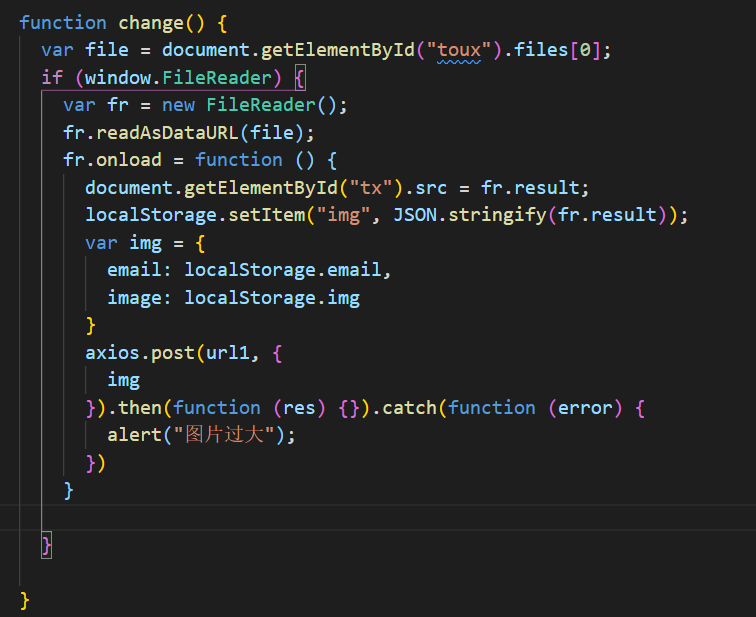
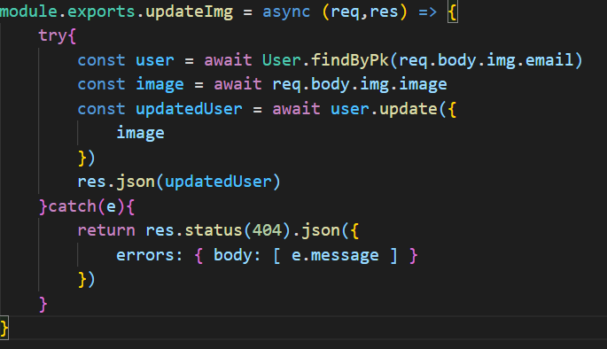

# 2021-2022学年第2学期
# **实 验 报 告**

- 课程名称:跨平台脚本开发技术  
- 实验项目:  期末大作业
- 专业班级：计算2004       
- 学生学号：32001170，32001103
- 学生姓名：彭一飞，胡晨炘
- 实验指导教师：郭鸣

## 实验内容

1. 项目分工表格
    - 1人项目权重为1.0
    - 2人项目权重和为 1.9

    
    
    | 姓名 |学号 |班级 |任务|权重|
    |:--|:--:|--:|--:|--:|
    | 胡晨炘 | 32001103 | 计算2004 | 2048+管理员后台+5*5 2048+界面优化 | 1.0 |
    | 彭一飞 | 32001170 | 计算2004 |2048+排行榜+登陆注册、个人信息|0.9|
    
1. 项目自我评估表

     

    | 技术点          | 自评等级:(1-5) | 备注 |
    |:--|:--:|---|
    | axios        |3|      |
    | express框架 |3|      |
    | ORM 工具（sequeliaze） |4|      |
    
1. 项目说明

    1. 项目  是基于现有的2048游戏代码开发(https://github.com/gabrielecirulli/2048）

        服务端 参考conduit-node-js-master

        - 开发  登陆模块  功能  用户可根据账号密码登陆页面
        - 开发  注册模块  功能  用户没有账号可以注册账号登录
        - 开发  选择模块  功能  登录用户可以根据自身需求选择4x4或5x5普通模式或者盲盒模式
        - 开发  排行榜模块  功能  录入用户最好成绩至数据库中
        - 开发  排行榜模块  功能  展示所有用户最好成绩的前5名，展示昵称、邮箱、分数
        - 开发  用户资料模块  功能  展示当前登录用户头像、姓名、邮箱
        - 开发  用户资料模块  功能  支持用户修改自身头像
        - 开发  用户资料模块  功能  支持用户修改自身昵称
        - 开发 管理员后台模块 功能 对用户信息进行增删查

1. 解决技术要点说明
    - 解决  最好成绩录入问题  关键代码与步骤如下
    
      
    
      
    
      
    
    - 解决  用户注册问题  关键代码与步骤如下
    
      
    
      
    
      
    
      解决  显示用户资料问题  关键代码与步骤如下
    
      
    
      
    
      
    
    - 解决  修改用户头像  关键代码与步骤如下
    
      
    
      
    
      
    
1. 心得体会（结合自己情况具体说明）

     - 大项目开发过程心得
        - 遇到哪些困难，经历哪里过程，有哪些收获
        
          熟悉了express框架的搭建和开发
        
          完成了前后端交互的开发
        
          学会了通过sequeliaze实现创建数据表和数据库的增删改查
        
          图片上传较为困难，尝试使用multer和fs方法保存图片至文件中一直实现不了，最后更换方法后实现
        
     - 本课程建议
         - 课程难度方面，进度方面，课程内容，授课方式等，给出你的意见
         
           课程难度比较大，希望老师在布置平时作业后稍微讲解一下